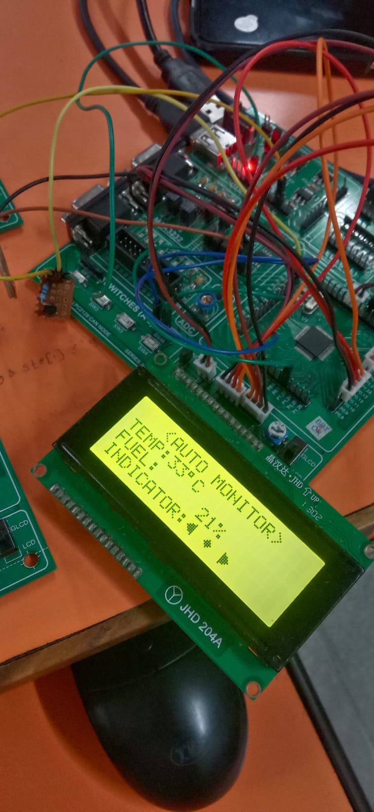
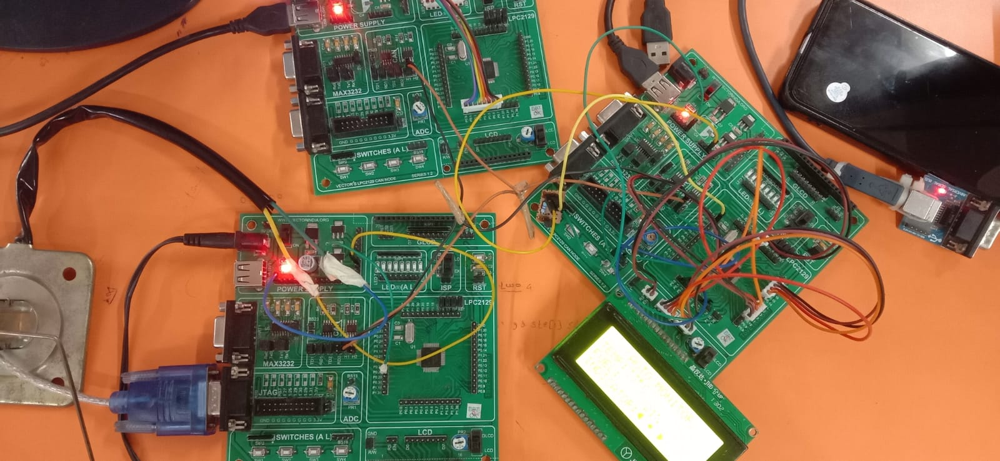
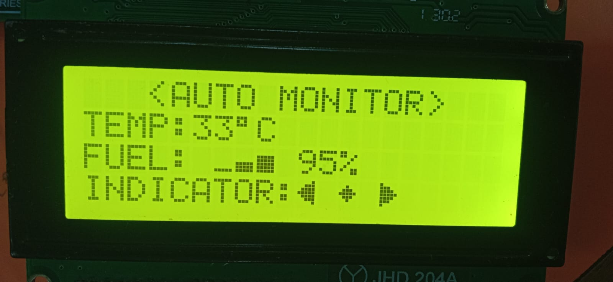

# 🚗 Automotive CAN Bus Monitoring System

An embedded systems project implementing a **multi-node CAN (Controller Area Network) bus** for real-time automotive parameter monitoring using the **LPC2129 ARM7 microcontroller**.

> ✅ **Fully built and tested on real hardware** — see demo photos below.

---
## 📸 Project Demo

<div align="center">

<table>
<tr>
<td align="center" width="33%">

<br>
<b>LCD Output (Live Readings)</b><br>
<sub>TEMP: 33°C | FUEL: 95% | Indicators active</sub>

</td>

<td align="center" width="33%">

<br>
<b>Full Hardware Setup</b><br>
<sub>LPC2129 CAN nodes interconnected via CAN bus</sub>

</td>

<td align="center" width="33%">

<br>
<b>Main Node + LCD</b><br>
<sub>JHD 204A LCD showing real-time data</sub>

</td>
</tr>
</table>

</div>

## 📌 Overview

This project simulates a simplified automotive ECU (Electronic Control Unit) network where multiple microcontroller nodes communicate over a CAN bus to monitor and display:

- 🌡️ **Engine Temperature** — via DS18B20 digital temperature sensor (1-Wire)
- ⛽ **Fuel Level** — via ADC-based analog fuel sensor, transmitted as 0–100%
- 🔄 **Turn Indicators (Left/Right)** — external interrupt-driven with LCD arrow blinking
- 📐 **Accelerometer Data** — via MMA7660 3-axis accelerometer over I2C

A central **Main Node** receives data from peripheral nodes and displays all parameters live on a **JHD 204A 20×4 character LCD**.

---

## 🏗️ System Architecture

```
┌─────────────────┐       CAN Bus       ┌────────────────────┐
│   FUEL NODE     │ ──────────────────► │                    │
│  (ADC + CAN TX) │     ID = 0x02       │     MAIN NODE      │
└─────────────────┘                     │  (LCD Display +    │
                                        │   CAN RX/TX)       │
┌─────────────────┐       CAN Bus       │                    │
│ INDICATOR NODE  │ ◄────────────────── │                    │
│  (LED Blinker + │     ID = 0x01       └────────────────────┘
│   CAN RX)       │
└─────────────────┘
```

### Nodes

| Node | File | Role |
|------|------|------|
| **Main Node** | `MAIN_NODE.c` | Central hub — reads DS18B20 temp, receives fuel via CAN, drives LCD, sends indicator commands on button press |
| **Fuel Node** | `FUEL_NODE.c` | Reads ADC fuel sensor, transmits fuel percentage over CAN (ID = 2) every 100ms |
| **Indicator Node** | `INDICATOR_NODE.c` | Receives indicator command over CAN (ID = 1), drives LED blink pattern (Left / Right / Off) |

---

## 🛠️ Hardware Used

| Component | Details |
|-----------|---------|
| **LPC2129** | ARM7TDMI-S microcontroller — Vector's LPC2129 CAN Node Board (×3) |
| **JHD 204A** | 20×4 character LCD (yellow-green backlight) |
| **DS18B20** | 1-Wire digital temperature sensor |
| **ADC Input** | Potentiometer simulating fuel sensor on ADC channel 1 |
| **CAN Bus** | Yellow/blue wires connecting CANH/CANL across all three boards |
| **MAX3232** | RS232 level shifter on each board (for ISP flashing) |
| **External Interrupts** | On-board push buttons (SW1/SW2) for Left/Right indicator |
| **Power** | USB-powered via individual connectors on each node board |

---

## 📺 LCD Display (What You See Live)

From the actual running hardware:

```
┌────────────────────┐
│  <AUTO MONITOR>    │  ← Title
│  TEMP: 33°C        │  ← DS18B20 temperature (live)
│  FUEL:  ███  95%   │  ← ADC fuel % via CAN from Fuel Node
│  INDICATOR: ◄ ♦ ►  │  ← Arrow blinks on button press
└────────────────────┘
```

- **Temperature** is read directly on the Main Node via 1-Wire protocol
- **Fuel** is sent from the Fuel Node over CAN every 100ms and displayed as custom CGRAM bar characters + percentage
- **Indicator arrows** on the LCD blink when SW1 (left) or SW2 (right) is pressed; the command is also sent over CAN to the Indicator Node

---

## ⚙️ CAN Bus Protocol

| Message ID | Direction | Data Byte | Meaning |
|------------|-----------|-----------|---------|
| `0x01` | Main Node → Indicator Node | `1` = Left, `2` = Right, `0` = Off | Indicator state |
| `0x02` | Fuel Node → Main Node | `0–100` | Fuel level percentage |

- **Baud Rate:** Configured via `BTR_LVAL` in `can_defines.h`
- **Acceptance filter:** Bypass mode (all CAN IDs accepted on all nodes)
- **TX timeout:** 50,000-cycle polling with graceful fallback to prevent lockup

---

## 📁 Project Structure

```
MAJOR_PROJECT/
    ├── MAIN_NODE.c          # Main node: LCD display + CAN hub
    ├── FUEL_NODE.c          # Fuel sensor node: ADC → CAN TX
    ├── INDICATOR_NODE.c     # Indicator node: CAN RX → LED blinker
    ├── CAN.c / can.h        # CAN bus driver (init, TX, RX)
    ├── can_defines.h        # CAN register & bit definitions
    ├── ds18b20.c / .h       # DS18B20 1-Wire temperature driver
    ├── MMA_7660.c / .h      # MMA7660 accelerometer I2C driver
    ├── LCD.c / lcd.h        # 20×4 LCD character driver
    ├── lcd_defines.h        # LCD command constants
    ├── I2C.c / i2c.h        # Bit-bang I2C master driver
    ├── INDICATOR.c / .h     # LED indicator step logic (left/right/off)
    ├── INDICATOR_GEN.c      # Indicator pattern generator
    ├── FUEL.c / fuel.h      # Fuel ADC read & scaling logic
    ├── delay.c / delay.h    # Microsecond / millisecond software delay
    ├── defines.h            # Bit manipulation macros (SETBIT, CLRBIT, etc.)
    ├── types.h              # Typedefs: u8, u32, s8, f32, etc.
    ├── Startup.s            # ARM7 reset & vector table (assembly)
    ├── major.uvproj         # Keil µVision project file
    ├── MAIN_NODE.hex        # Compiled firmware — flash to Main Node board
    ├── FUEL_NODE.hex        # Compiled firmware — flash to Fuel Node board
    └── IND_NODE.hex         # Compiled firmware — flash to Indicator Node board
```

---

## 🚀 Getting Started

### Prerequisites

- **Keil µVision 4/5** (ARM MDK) — for building
- **Flash Magic** — for flashing `.hex` to LPC2129 via UART/ISP
- 3× Vector's LPC2129 CAN Node Boards
- DS18B20 sensor, JHD 204A 20×4 LCD, potentiometer

### Build

1. Open `major.uvproj` in Keil µVision.
2. Select target: **Main Node**, **Fuel Node**, or **Indicator Node**.
3. Press `F7` to build.

### Flash

| Board | HEX File | Notes |
|-------|----------|-------|
| Main Node | `MAIN_NODE.hex` | Connect LCD + DS18B20 |
| Fuel Node | `FUEL_NODE.hex` | Connect potentiometer to ADC1 |
| Indicator Node | `IND_NODE.hex` | LED on P0.10 |

Use **Flash Magic** with UART (MAX3232 on-board), ISP mode — hold ISP button during reset to enter programming mode.

### Wiring the CAN Bus

Connect the three boards:
- **CANH** (yellow wire) → all three boards in parallel
- **CANL** (blue wire) → all three boards in parallel
- Place **120Ω termination resistors** at both ends of the bus

---

## 🔌 Pin Configuration (LPC2129)

| Peripheral | Pin |
|------------|-----|
| CAN1 RD/TD | P0.25 (RD1) via PINSEL1 |
| DS18B20 Data | P0.22 (1-Wire) |
| I2C SDA/SCL | P0.2 / P0.3 |
| LCD Data/Ctrl | IOPIN0 (per `lcd_defines.h`) |
| Indicator LED | P0.10 |
| TX Status LED | P0.0 |
| Left Indicator Button | EINT1 |
| Right Indicator Button | EINT2 |

---

## 🧠 Key Learnings

- CAN bus multi-node communication on ARM7
- 1-Wire protocol implementation for DS18B20
- Custom LCD CGRAM character creation (fuel bar blocks, indicator arrows)
- ADC-to-percentage conversion and CAN message framing
- I2C master driver from scratch for MMA7660 accelerometer
- External interrupt handling and debouncing on LPC2129

---

## 👨‍💻 Author

**Shivanjali Dhumal** — Embedded Systems Major Project  
Platform: Vector's LPC2129 CAN Node Board | Keil µVision | Flash Magic

---

